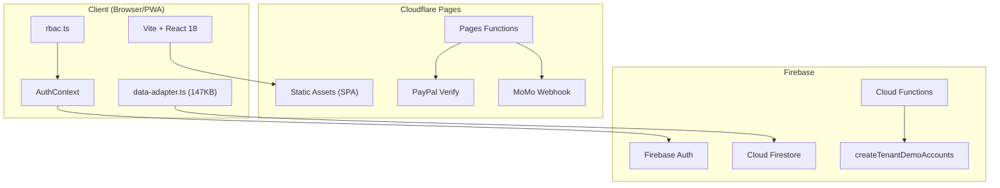
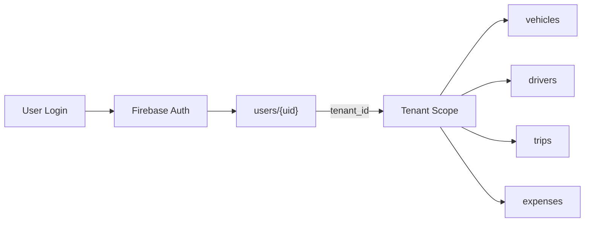
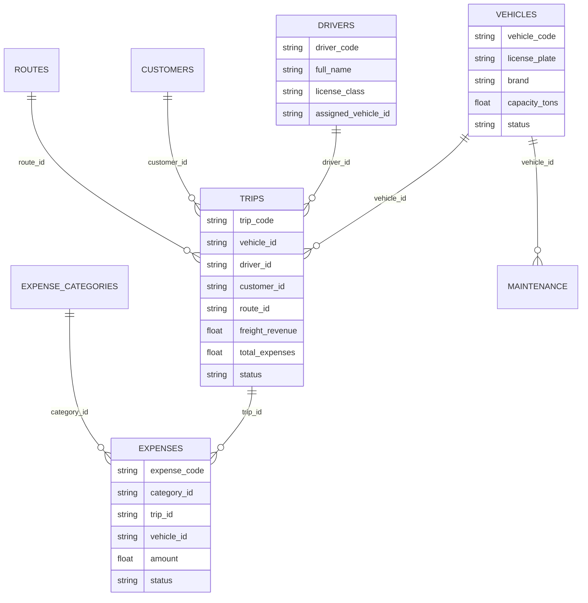
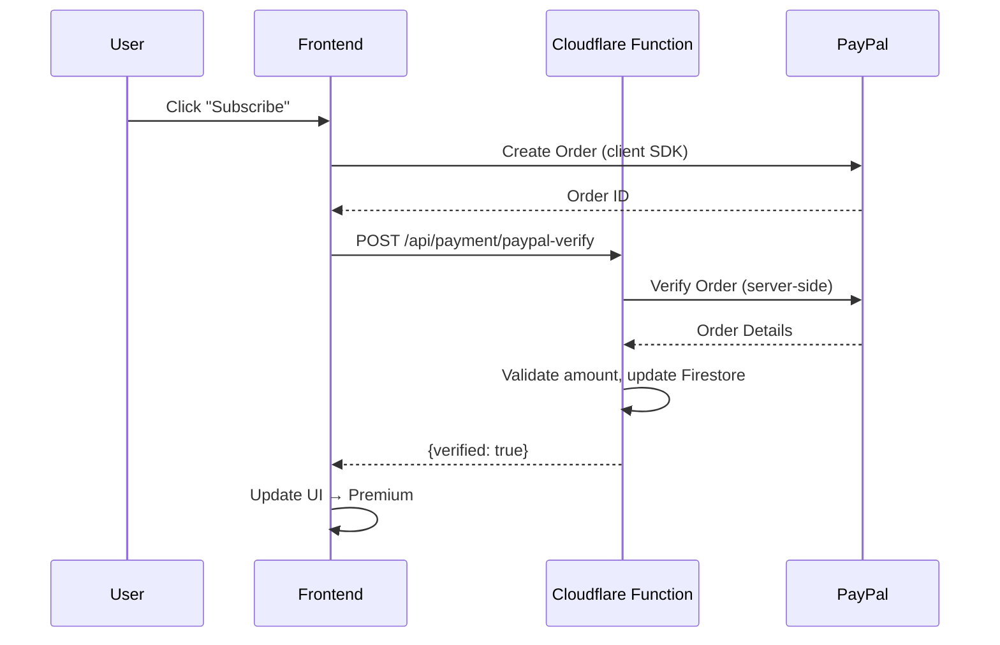

# FleetPro — System Architecture

## System Overview



## Multi-Tenant Architecture

Every document in Firestore carries a `tenant_id` field. Access is enforced at two layers:

1. **Firestore Security Rules** — Server-side, per-document
2. **`data-adapter.ts`** — Client-side, automatic `tenant_id` injection



### Tenant Document Naming Convention

```
Collection: vehicles
Document ID: {tenantId}_vehicles_{sourceId}
Example:     internal-tenant-phuan_vehicles_XE0001

Collection: company_settings
Document ID: {tenantId}  (no suffix — one per tenant)
```

## RBAC Model (6 Roles)

| Role | Scope | Key Permissions |
|---|---|---|
| `superadmin` | All tenants | System config, tenant management |
| `admin` | Own tenant | Full CRUD, user management, settings |
| `manager` | Own tenant | Dispatch, trips, reports (no settings) |
| `accountant` | Own tenant | Expenses, reconciliation, accounting periods |
| `dispatcher` | Own tenant | Trip assignment, vehicle tracking |
| `driver` | Own data | View assigned trips, create draft trips, GPS |

Defined in `src/lib/rbac.ts`. Route-level guards in `src/components/layout/AppSidebar.tsx`.

## Data Model (Firestore Collections)



### All Collections

| Collection | Index | Description |
|---|---|---|
| `vehicles` | XE0001 | Fleet registry |
| `drivers` | TX0001 | Driver profiles |
| `customers` | KH0001 | Client companies |
| `routes` | TD0001 | Route definitions (origin→dest, cost) |
| `trips` | CD00001 | Trip records (revenue, expenses linked) |
| `expenses` | PC00001 | Cost records (fuel, tolls, wages) |
| `expenseCategories` | CAT001 | Expense classification |
| `maintenance` | BD0001 | Vehicle maintenance log |
| `transportOrders` | DH0001 | Customer transport orders |
| `alerts` | ALR001 | System alerts (expiry, overdue) |
| `accountingPeriods` | AP2026-04 | Monthly accounting periods |
| `company_settings` | {tenantId} | Tenant config & branding |
| `users` | {firebase_uid} | User accounts |
| `tenants` | {tenantId} | Tenant registry |
| `counters` | {tenantId}_{prefix} | Sequential ID counters |
| `system_logs` | auto | Audit trail |

## Directory Structure

```
src/
├── components/           # 128 files across 26 modules
│   ├── auth/             # Login, registration forms
│   ├── chat/             # AI chat assistant
│   ├── common/           # Shared UI (SearchInput, StatusBadge)
│   ├── customers/        # Customer CRUD
│   ├── dashboard/        # Dashboard widgets & charts
│   ├── dispatch/         # DispatchHub — trip assignment
│   ├── driver/           # Driver-specific UI (quick trip, vehicle bind)
│   ├── drivers/          # Driver management CRUD
│   ├── expenses/         # Expense entry & audit
│   ├── finance/          # SmartExpenseAudit, reconciliation
│   ├── layout/           # AppSidebar, AppHeader, DriverLayout
│   ├── onboarding/       # GuidedTour, first-time user flow
│   ├── pwa/              # PWA install prompt
│   ├── reports/          # Revenue/expense charts
│   ├── routes/           # Route management
│   ├── settings/         # Settings sub-forms
│   ├── shared/           # PaywallGuard, ThemeInjector
│   ├── sync/             # Google Drive backup
│   ├── tracking/         # GPS tracking, 4-step delivery
│   ├── trips/            # Trip CRUD, driver quick trip modal
│   ├── ui/               # shadcn/ui primitives
│   └── vehicles/         # Vehicle management
│
├── pages/                # 42 page-level components
│   ├── Auth.tsx           # Login/Register
│   ├── Dashboard.tsx      # Main dashboard
│   ├── Vehicles.tsx       # Fleet management
│   ├── Drivers.tsx        # Driver management
│   ├── TripsRevenue.tsx   # Trips & revenue
│   ├── Expenses.tsx       # Cost management
│   ├── Routes.tsx         # Route config
│   ├── Customers.tsx      # Client management
│   ├── Settings.tsx       # System settings + demo tool
│   ├── Maintenance.tsx    # Vehicle maintenance
│   ├── Reports.tsx        # Analytics & reports
│   ├── Pricing.tsx        # Public pricing page
│   ├── driver/            # DriverDashboard (PWA)
│   └── docs/              # PhuAnDocs
│
├── hooks/                # 28 custom hooks
│   ├── useAuth.ts         # Auth state
│   ├── usePermissions.ts  # RBAC guards
│   ├── useCompanySettings.ts # Tenant branding
│   ├── useTrips.ts        # Trip CRUD operations
│   ├── useExpenses.ts     # Expense CRUD
│   └── useReportData.ts   # Dashboard analytics
│
├── lib/                  # Core business logic
│   ├── data-adapter.ts    # 147KB — ALL Firestore CRUD + seed logic
│   ├── firebase.ts        # Firebase SDK init
│   ├── rbac.ts            # Role definitions & permissions
│   └── schemas.ts         # Zod validation schemas
│
├── services/             # Background services
│   ├── AIQueryService.ts          # AI-powered data queries
│   ├── demoOnboardingService.ts   # Demo data verification
│   └── backgroundSyncService.ts   # Google Drive sync
│
├── contexts/             # React contexts
│   └── AuthContext.tsx    # Global auth + tenant state
│
└── config/               # Configuration
    └── constants.ts       # Feature flags, tenant whitelist
```

## Payment Flow



## Deployment Pipeline

```
Developer → git push main → GitHub → Cloudflare Pages (auto-deploy)
                                   ↓
                              Build: npm run build
                              Output: dist/
                              Domain: tnc.io.vn, phuan.tnc.io.vn
```

### Manual deploy steps:
```bash
# Firestore rules (separate from app deploy)
npx firebase deploy --only firestore:rules

# Cloud Functions (if changed)
cd functions && npm run deploy
```
